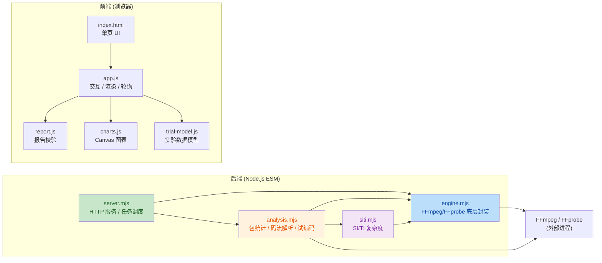
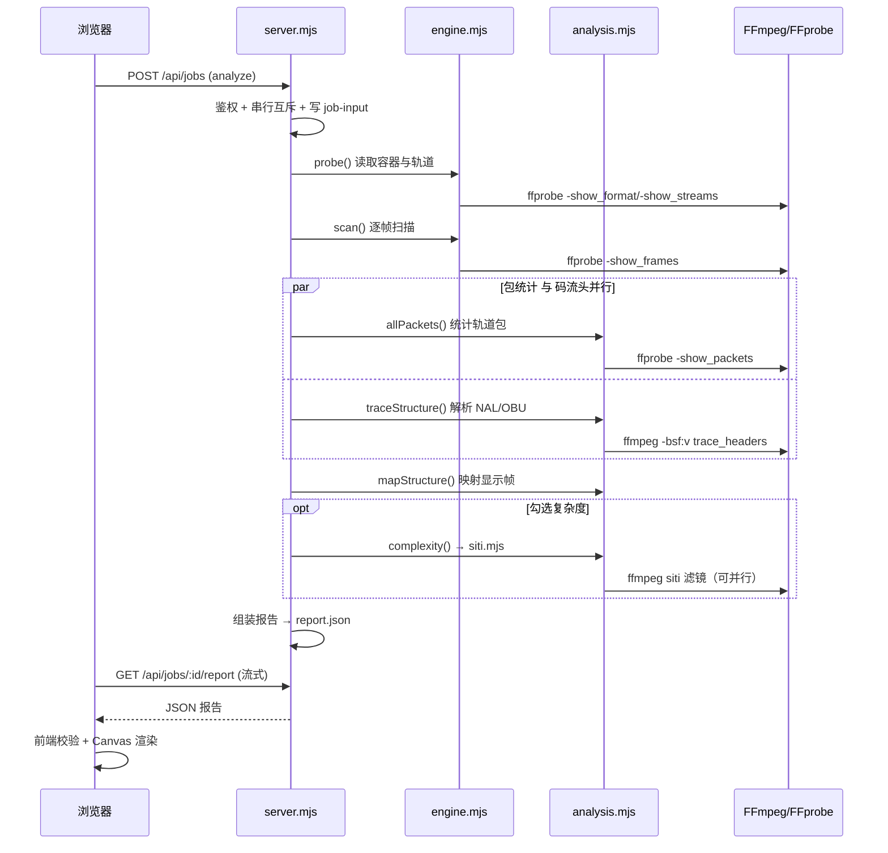

# MediaScope 0.1.7-beta 项目分析文档

## 一、项目概览

MediaScope 是一个 **Windows 本地媒体结构与质量分析工具**。核心定位是：**媒体文件不上传、原文件只读**，在本机用 FFmpeg/FFprobe 完成容器结构解析、编码帧头解析、质量指标（PSNR/SSIM/VMAF）测量与短片段率失真（CRF）实验，并在浏览器里用自绘 Canvas 图表呈现结果。

关键特征：

| 维度 | 内容 |
|------|------|
| 运行形态 | 本地 HTTP 服务（仅监听 `127.0.0.1`）+ 浏览器前端，服务端原生 Node.js |
| 外部依赖 | 仅 FFmpeg / FFprobe（通过 `FFMPEG_PATH` / `FFPROBE_PATH` 或 `runtime/` 内置二进制定位） |
| npm 依赖 | 无（`package.json` 中无 dependencies） |
| 模块体系 | ESM（`"type": "module"`），Node.js ≥ 22 |
| 数据产物 | `.mediascope/<任务UUID>/report.json`，schema `MediaScope/0.2` |
| 报告导入 | 浏览器本地读取 JSON（上限 256 MiB），可离线还原预览 |

---

## 二、技术栈与运行约束

- **后端**：Node.js `node:http`、`node:child_process`（spawn/execFile）、`node:fs/promises`、`node:crypto` 等内置模块，无第三方依赖。
- **前端**：原生 HTML + ES Module JS + Canvas 2D 绘图，无框架、无构建步骤。CSS 为手写压缩样式（深色主题）。
- **媒体引擎**：FFprobe 负责探测（`-show_format`/`-show_streams`/`-show_frames`/`-show_packets`/`-show_chapters`），FFmpeg 负责解码、质量滤镜（`psnr`/`ssim`/`libvmaf`）、`trace_headers` 码流头解析、`siti` 复杂度滤镜与试编码。
- **安全边界**：仅绑定回环地址；校验 `Host` 头；API 要求会话令牌 `x-mediascope-token`；静态资源带严格 CSP；媒体路径经规范化清洗。

---

## 三、模块架构与依赖关系



依赖方向清晰：`server.mjs` 是唯一入口；`analysis.mjs` / `siti.mjs` 均复用 `engine.mjs` 的 `run`/`probe`/`scan`/`compare` 等原语；前端 `app.js` 是唯一编排层，其余三个 JS 文件是纯函数模块（便于用 `node:vm` 做无 DOM 测试）。

---

## 四、目录结构

```
MediaScope/
├── server.mjs            # HTTP 服务入口 + 任务编排
├── engine.mjs            # FFmpeg/FFprobe 封装 + 质量比较核心
├── analysis.mjs          # 包统计 / NAL-OBU 解析 / 试编码
├── siti.mjs              # SI/TI 复杂度测量
├── package.json          # 版本 0.1.7-beta，type:module
├── start.cmd             # Windows 启动脚本
├── README.md             # 完整功能与口径说明
├── RELEASING.md          # 发布规范
├── .gitignore            # 忽略 .mediascope/test-work/.build/releases
├── public/               # 前端静态资源
│   ├── index.html
│   ├── app.js
│   ├── charts.js
│   ├── report.js
│   ├── trial-model.js
│   └── style.css
├── test/                 # 9 个测试（node --test）
├── scripts/              # 打包/清理/校验 PowerShell 脚本
├── licenses/             # Node.js 许可证
└── .github/              # Release 模板
```

> 注：`test-work/`（测试生成素材）、`.mediascope/`（任务报告）、`.build/`（打包暂存）、`releases/*.zip` 均为运行时/生成产物，已被 `.gitignore` 排除，不属于源码。

---

## 五、逐文件与逐代码块详解

### 5.1 server.mjs —— HTTP 服务与任务调度

**整体职责**：启动本地 HTTP 服务、鉴权与路由、串行任务调度（一次一个计算任务）、进度发布、结果落盘与流式下载、Windows 文件选择器桥接。

| 行号 | 代码块 | 作用 |
|------|--------|------|
| 1–13 | import 与常量 | 引入内置模块；`token = randomBytes(24)` 生成会话令牌；`jobs = new Map()` 保存任务；`port` 取 `PORT` 环境变量默认 4317；`origin` 为回环地址 |
| 14 | `active`/`pickerActive` | 互斥标志：同一时刻仅一个计算任务、仅一个文件选择器 |
| 15–16 | `versions` 探测 | 启动时对 ffmpeg/ffprobe 各跑一次 `-version`，取首行作为版本 |
| 17–18 | `capabilities` | 读取 FFmpeg 滤镜列表，判定 `psnr`/`ssim`/`libvmaf` 是否可用 |
| 19 | `send()` | 统一 JSON 响应（`no-store`，禁用缓存） |
| 20 | `body()` | 读取请求体，>16 KB 报错，返回 JSON 对象 |
| 21–29 | `normalizeInputPaths()` | 按任务类型规范化路径并校验 `sitiWorkers`（仅允许 1/2/4/6/8 或 auto） |
| 30–41 | `selectMediaFile()` | 用 PowerShell `System.Windows.Forms` 弹 Windows 文件选择器，经 UTF-16LE→base64 传脚本，返回绝对路径 |
| 42 | `execute()` | 任务执行主流程（见下） |
| 43–44 | 落盘 job-input | 在 `.mediascope/<id>/` 写入 `job-input.json` 留痕 |
| 45–64 | `publish()` | 进度发布回调：清洗字段、合并 phase/subtask、维护 `subtasks` 字典 |
| 65 | `ctx` | 构造执行上下文（cwd、signal、commands、separateMetrics、decodeThreads、sitiWorkers、update） |
| 66–75 | `stage()` | 阶段包装器：自动记录每个阶段的 `elapsedSeconds`，支持 `concurrentGroup`（并行阶段耗时不能相加） |
| 78–99 | inspect/analyze 分支 | inspect 单阶段 probe；analyze 按复杂度选 3 或 4 阶段，支持顺序/并行两条路径 |
| 100–110 | compare 分支 | 前置确认检查 + 调 `compare` + 分别统计两路视频包体积 |
| 111–113 | trial 分支 | 调 `trialOptions` 与 `trial` |
| 114–118 | 结果组装与落盘 | 写入 `report.json`，删除内存大对象，`job.reportPath` 指向磁盘 |
| 119 | 失败/取消落盘 | 写 `failure.json`，保留 commands 便于复现 |
| 122–150 | HTTP 路由 | 鉴权、`/api/status`、`/api/select-file`、`/api/jobs`、`/api/jobs/:id[/report]`、静态文件与 CSP |
| 135–141 | 任务创建 | 串行互斥（`active`）、最多保留 5 个内存报告、创建 AbortController、返回 202 |
| 147 | token 注入 | 将 `__TOKEN__` 替换到 `index.html`，使前端拿到令牌 |
| 151–153 | 监听/退出 | 绑定 `127.0.0.1`，SIGINT 时中止所有任务并优雅退出 |

**关键设计**：`stage()` 通过 `concurrentGroup` 标记并行阶段，报告中明确"同一 concurrentGroup 的耗时相互重叠，不能相加"；`publish()` 严格区分"已完成数 / 总量"与 null，避免伪造完成率。

---

### 5.2 engine.mjs —— FFmpeg/FFprobe 底层封装与质量比较核心

**整体职责**：进程调用原语、路径规范化、探测/帧扫描/包统计、比较域校验、时间对齐、跨位深映射、质量指标计算。

| 行号 | 代码块 | 作用 |
|------|--------|------|
| 9–13 | FF/FP 定位 | `bundled()` 优先找 `runtime/` 下的 exe；`decodeThreadCount()` 取 `min(12, 逻辑核数)` |
| 14–27 | `run()` | 核心 spawn 封装：支持 `line` 逐行回调、`stderrLine`、32 MiB 输出上限、退出码与错误处理，记录 elapsedSeconds/exitCode |
| 28–36 | `normalizeMediaPath()` | 去不可见方向字符、剥离成对引号、全角冒号转半角、校验绝对路径 |
| 37–44 | `probe()` | 探测容器格式/流/章节 + 开头最多 32 包解码帧附加数据（frameSample），注明"仅抽样" |
| 45 | `video()` | 按索引取视频流，无效则报错 |
| 46–65 | `scan()` | 逐帧扫描：解析 compact 格式，校验逐行/格式一致性，50 万帧上限，输出 `{pts,t,duration,bytes,type,key}` |
| 66–75 | `packets()` | 单流包字节统计（旧路径，按 PTS 1 秒窗口，缺 PTS 回退 DTS） |
| 76–80 | `summarize()` | 帧型分布、GOP 关键帧间隔、非递增时间戳计数 |
| 81–85 | `validateComparableStreams()` | 逐字段校验两流可比（分辨率/像素格式/色彩/色度位置），返回位深计划 |
| 86–102 | `resolveChromaAssumptions()` | 允许用户为未声明色度位置补充假设，禁止覆盖已声明值 |
| 103–122 | `alignment()` | 严格/按帧序时间对齐：校验帧数、时间戳递增、相对时间戳差（0.1 ms 容差）、末帧时长 |
| 123–133 | `rationalValue`/`rateValue` | `rationalValue()` 解析正的 `num/den` 有理数；`rateValue()` 仅在实验性播放采样模式中接受 1–120 fps 的帧率作为 CFR 网格候选，随后由 `playbackAlignment()` 核验逐帧时间戳 |
| 134–175 | `playbackAlignment()` | 实验性 VFR↔CFR 播放采样：核验 CFR 网格、估计采样帧索引、重复/未采样计数 |
| 176–187 | `comparisonProfile()` | 解析像素格式（420/422/444、8/10/12-bit），判定 HDR/SDR 与 VMAF 适用性 |
| 188–206 | `bitDepthPlan()` | 跨位深 8↔10-bit 计划：生成 `scale` 滤镜精确乘 4，PSNR 峰值 1023 |
| 207–216 | `verifyBitDepthMapping()` | 用全码值（0–255）+空间变化图样自检映射是否为精确 ×4，未通过则拒绝 |
| 217–224 | `bitDepthReductionFilter()` | 10→8-bit `floor(code/4)` 截断滤镜 |
| 225–232 | `verifyBitDepthReduction()` | 10→8-bit 截断自检 |
| 233–237 | `createComparisonSession()` | WeakMap 会话，缓存任务自有的参考文件验证结果 |
| 238–246 | `referenceEntry()` | 参考文件复用探测/扫描，校验文件标识/大小/mtime 变化则拒绝复用 |
| 247–323 | `compare()` | 质量比较总流程（见下） |

**`compare()` 流程分解**（247–323）：
1. 读取参考/候选探测，解析色度假设；
2. 校验指标选择与 VMAF 适用性（不适用的标注跳过，仅选 VMAF 时报错）；
3. 扫描两路帧（复用参考扫描缓存，候选必扫）；
4. 对齐（strict / ordinal / playback-sample）；
5. 跨位深时验证映射；
6. 按指标组（共享或独立解码）构造 FFmpeg 滤镜图并计算；
7. 解析日志：PSNR 在 MSE 域汇总、SSIM/VMAF 逐帧等权、分量 Y/U/V 提取、最差 5 个 1 秒区间；
8. 输出结果 + 完整警告清单。

---

### 5.3 analysis.mjs —— 包统计 / 码流解析 / 试编码

**整体职责**：所有轨道包字节统计、H.264/HEVC/AV1 码流头解析与显示帧映射、GOP 构建、元数据去重、SI/TI 封装、片段试编码。

| 行号 | 代码块 | 作用 |
|------|--------|------|
| 6–8 | 常量 | HEVC NAL 类型名映射、AV1 帧类型、`num()` 转换 |
| 9 | `distribution()` | 统计 min/mean/p05/p95/max/count |
| 12–23 | `allPackets()` | 所有轨道共享 PTS 1 秒窗口统计，显式补齐空秒，返回 bins/平均码率/窗口分布 |
| 26–33 | `av1ShortRefs()` | 按 AV1 规范从短参考信令推导 7 个参考槽 |
| 35–82 | `createTraceParser()` | 增量解析 `trace_headers` 输出：识别 Packet/OBU/Frame Header，记录 NAL 类型、恢复点、时间层、POC LSB、AV1 帧头字段与参考槽 |
| 84–89 | `traceStructure()` | 调 FFmpeg `-bsf:v trace_headers` 全流解析（仅 h264/hevc/av1） |
| 91–114 | `mapStructure()` | 将编码事件映射到显示帧，判定 IDR/NON_IDR、HEVC 访问类型、AV1 显示事件，统计 matched 数 |
| 116 | `structure()` | traceStructure + mapStructure 的组合 |
| 118–121 | `buildGops()` | 按关键帧/IDR/CRA/BLA/KEY 边界切分 GOP 区间 |
| 123–128 | `metadataSummary()` | 合并轨道与开头抽样中相同的附加数据，标明来源与重复次数 |
| 130–135 | `complexity()` | SI/TI 门面：校验像素格式后调 `measureSiti` 并汇总分布 |
| 137–152 | `trialOptions()` | 校验试编码参数（编码器、CRF 范围、preset、位深模式、编码点数上限 64） |
| 153–216 | `trial()` | 试编码总流程（见下） |

**`trial()` 流程分解**（153–216）：
1. 探测源文件、校验片段长度（1–20 s）、像素格式（420 8/10-bit）、逐行；
2. 预算校验（原始像素 ≤ 8 GiB）；
3. 解码片段为 FFV1 无损参考（`reference.mkv`），保留色彩声明；
4. 若双位深：准备另一深度无损输入（升位深精确 ×4 / 降位深截断），并计算编码前基准差异；
5. 逐（preset × CRF × 位深）编码点：真实编码、计时、测视频包/码率/PSNR/SSIM；
6. 默认完成后清理临时文件，`keepFiles` 可保留。

---

### 5.4 siti.mjs —— SI/TI 内容复杂度

| 行号 | 代码块 | 作用 |
|------|--------|------|
| 4–10 | `sitiWorkerCount()` | 依据帧数、像素、可用内存（25%）、逻辑核数、请求上限决定并发路数（1–8） |
| 12–28 | `measure()` | 单进程跑 `siti` 滤镜，从 `metadata` 日志逐帧解析 SI/TI，支持 `select` 分段 |
| 30–72 | `measureSiti()` | 并发调度：按帧分段、首段外前置 1 帧重叠，合并校验总帧数/重叠帧，失败回退串行 |

**并发正确性设计**：每段从前一帧开始解码以保证 TI 有前置帧；合并时校验重叠帧时间戳与 SI 一致；总帧数不符即回退串行；取消时不启动串行回退。

---

### 5.5 前端

#### index.html（24 行）
单页三页签布局：**01 文件分析 / 02 质量对比 / 03 片段实验**，含导入按钮、任务进度卡、三个结果区、图表读法说明。所有交互元素 ID 与 `app.js` 一一对应；`<meta name="token">` 占位 `__TOKEN__` 由服务端注入。

#### app.js（192 行）
前端编排核心：

| 行号 | 代码块 | 作用 |
|------|--------|------|
| 1–12 | import 与全局状态 | `reports` 按页签各存一份，`viewCharts` 存图表实例，`activeMode`/`renderingMode` |
| 13 | `api()` | 带令牌的 fetch 封装 |
| 14–26 | 进度渲染 | `message()`/`progressValue()`/`elapsed()`：区分确定性进度与"总量待核验" |
| 27 | `busy()` | 任务期间禁用控件 |
| 28–30 | `launch()`/`poll()`/取消 | 发起任务、900 ms 轮询、完成后拉取报告 |
| 31–36 | `switchMode()` | 切换页签，不重绘其他页签 |
| 37–39 | 文件选择器/复杂度联动 | 打开文件对话框、SI/TI 并行选项联动 |
| 40–70 | 各模式提交 | 组装 inspect/analyze/compare/trial 的 input 对象与前置确认 |
| 71–85 | 导出/导入 | 下载 JSON、导入校验（256 MiB 上限、失败回滚） |
| 93–100 | `render()` | 统一渲染入口，管理 renderingMode 与图表生命周期 |
| 101–129 | `renderMedia()` | 渲染分析报告：轨道清单、色彩声明、帧结构/GOP、AV1 事件、码率、SI/TI、元数据 |
| 130–143 | `initFrames()` | 帧带图、GOP 概览、逐帧列表/CSV、AV1 事件详情 |
| 144–161 | `renderComparison()` | 渲染对比报告：对齐信息、跨位深映射、分量、最差区间 |
| 162–191 | `renderTrial()` | 渲染实验：采样点表、CRF 四图、码率-质量图、逐帧叠加图 |
| 192 | 启动 | 拉 `/api/status`，恢复运行中任务、禁用不可用指标 |

#### charts.js（74 行）
纯函数 Canvas 图表库：`plot()` 提供可缩放/平移/框选/Ctrl+滚轮/双击全览的有界视口，密集曲线按像素列保留极值，缺失/无限值断开连线；`gopOverview()` 绘制全片 GOP 色带。可被 `node:vm` 测试（无 DOM 依赖处）。

#### report.js（53 行）
`parseReport()` / `validateReport()`：严格校验导入报告的 schema（仅 `MediaScope/0.1`、`0.2`）、字段类型、帧数一致性、GOP 连续性、AV1 事件 ID、播放采样字段等，**不归一化、不舍入、不丢弃证据**，防止不完整数据静默渲染。

#### trial-model.js（43 行）
实验数据模型纯函数：`parseCrfs()`（逗号/范围 `起:终:步长`）、`rowLabel()`、`sortTrialRows()`、`trialPlotData()`、`trialFramePlotData()` 等，为图表提供分组/排序/曲线数据。

#### style.css（10 行压缩）
深色主题全套样式：布局、卡片、表格、任务进度条（确定性/不定态动画）、图表控件、响应式断点。

---

### 5.6 测试（test/，共 9 个）

| 文件 | 覆盖内容 |
|------|---------|
| engine.test.mjs | 中文路径、多音轨、帧/包统计、同文件 PSNR=∞、错位拒绝、H.264 IDR、HEVC CRA、AV1 事件、SI/TI、试编码、原生 YUV 矩阵（420/422/444 × 8/10/12-bit） |
| server.test.mjs | HTTP 鉴权（403）、串行互斥（409）、SI/TI 参数校验、取消任务、跨位深 opt-in、报告复现 |
| report.test.mjs | 用 `node:vm` 无 DOM 测试前端：JSON 往返、非法报告拒绝、页签隔离、进度条不伪造百分比 |
| siti.test.mjs | 并行 SI/TI 与串行逐样本一致、回退逻辑、取消不启动串行 |
| chart-model.test.mjs | 曲线断点、排序不改变原数组、时间戳保留 |
| performance.test.mjs | 共享解码 vs 独立解码等价、参考缓存、结构并行 vs 顺序等价 |
| bitdepth.test.mjs | 跨位深全码值精确映射、跨采样/隔行拒绝 |
| chroma-assumption.test.mjs | 色度位置假设补充/不可覆盖/证据保留 |
| trial.test.mjs | 扩展参数校验、双位深截断/升位深、清理、编码器分支 |

测试统一用 `lavfi`（testsrc2/nullsrc）生成合成素材于 `test-work/`，不使用用户媒体。

---

### 5.7 构建与发布脚本（scripts/）

| 文件 | 作用 |
|------|------|
| package-prerelease.ps1 | 生成**轻量预发布** ZIP（不含 Node/FFmpeg/FFprobe），校验 package.json 版本一致，写 MANIFEST.json（逐文件 SHA-256） |
| package.ps1 | 生成**正式版** Windows x64 便携包（含 runtime/ 与 Launch.cmd），需 `-Formal` 显式确认 |
| verify-release.ps1 | 校验 ZIP 内 MANIFEST 的每个文件大小与 SHA-256，拒绝重复条目、私有数据泄漏 |
| cleanup.ps1 | 安全清理 `test-work`、合成报告与打包暂存，保留真实用户报告（含路径越界/符号链接防护） |

### 5.8 配置与文档

- **start.cmd**：设置 runtime 路径与 FFMPEG_PATH/FFPROBE_PATH，检查依赖后 `node server.mjs`。
- **package.json**：`name: mediascope`、`0.1.7-beta`、`type: module`、脚本 `start`/`test`、`engines: node >=22`。
- **.gitignore**：忽略 `.mediascope/`、`test-work/`、`.build/`、`releases/*.zip`。
- **README.md**：功能、口径、图表读法、版本演进（0.1.4–0.1.7）的权威说明。
- **RELEASING.md / .github/RELEASE_TEMPLATE.md**：发布流程与正文模板规范。

---

## 六、核心工作流程（时序）



---

## 七、关键设计决策与边界

1. **不伪造数据**：进度只在总量已确定时显示百分比，否则标"总量待核验"；峰值/缺失值保留断点；元数据抽样明示"抽样未发现≠全片不存在"。
2. **比较不做隐式转换**：默认原生同格式，跨位深/按帧序/播放采样均为**显式 opt-in** 且需用户确认；逐帧校验格式与色彩声明，变化即拒绝。
3. **测量与推断分离**：GOP 是显示帧区间视图，不把 CRA 自动认定为闭合 GOP；AV1 短参考信令按规范推导但标注"未完整验证解码依赖图"。
4. **可复现性**：报告保留完整命令、工作目录、工具版本、每个子进程的 elapsedSeconds/exitCode；导入时严格校验，不补造缺失字段。
5. **安全与隐私**：仅回环监听、令牌+来源校验、CSP、路径清洗、报告流式读取不驻留内存大对象、清理脚本不越界删除用户报告。
6. **测试即文档**：大量断言（如 PSNR 分量解析公式、跨位深 ×4 精确性、并行与串行结果逐样本一致）固化了规范口径。
